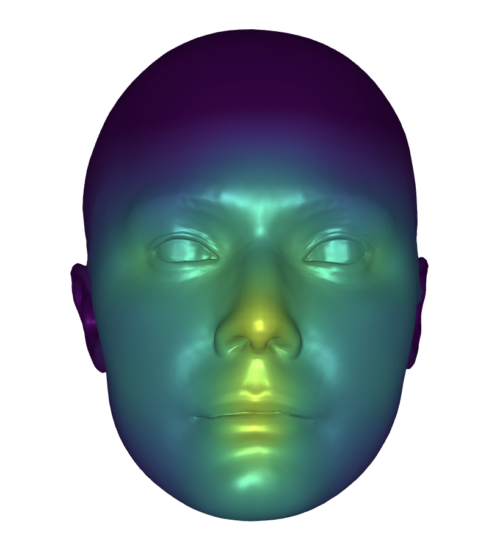
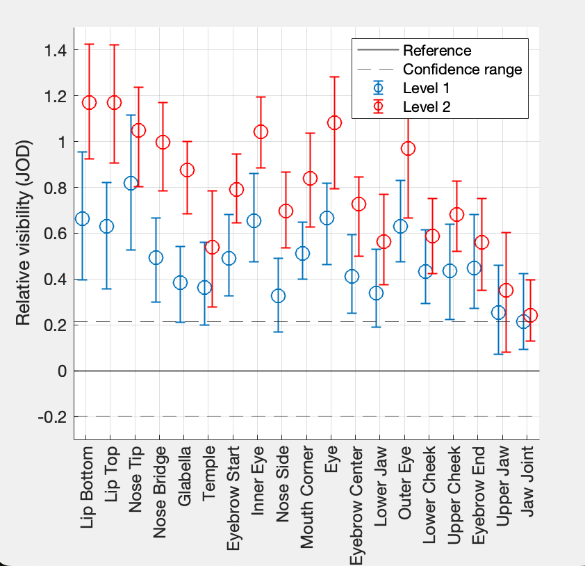
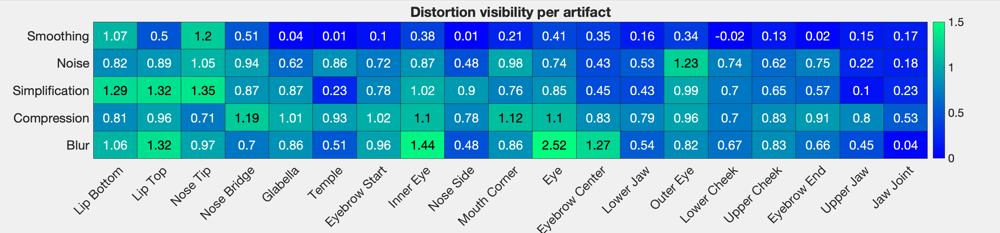

# FaceMap: Distortion-Driven Perceptual Facial Saliency Maps

😀 This is the official implementation and data release for [FaceMap](paper/FaceMap__Distortion_Driven_Perceptual_Facial_Saliency_Maps.pdf), to present in Siggraph Asia 2024

😊 __Contributors__:
Zhongshi Jiang, Kishore Venkateshan, Giljoo Nam, Meixu Chen, Romain Bachy, Jean-Charles Bazin, Alexandre Chapiro. (*Reality Labs, Meta*)

<!--  -->

😆 __Abstract__:
Humans are uniquely sensitive to faces. Recognizing fine detail in faces
plays an important role in social cognition, identity; and it is key to human
interaction. In this work, we present the first quantitative study of the relative
importance of face regions to human observers. We created a dataset of *960
unique models* featuring localized geometry and texture distortions relevant
to visual computing applications. We then conducted an extensive subjective
study examining the perceptual saliency of facial regions through the lens
of distortion visibility. Our study comprises *over 18,000 comparisons* and
indicates non-trivial preferences across distortion types and facial areas. Our
results provide relevant insights for algorithm design, and we demonstrate
our data’s value in model compression applications.

# Updates
💡 10/26/2024: Initial Commit

# Repo
As part of our open source commitment, we release the data, analysis script, and script for distortion generation.
## Data

Our released data includes:
* Pre-generated distorted face model in the main user study
* User response data in the main study
* Rendered images and videos used in the follow up applications.
* User response data in the follow-up validation study (random landmarks, Gaussian Avatar evaluation, and Re-mesh application evaluation).
```python
data
- main_study # Data and response in the main study
  - MainStudyGeoms.zip # pre-generated distorted faces we used
  - head*_Experiment_History.csv # recorded user study response
  - processed/bs100 # scaled JOD results
- applications # GaussAvatar and Remesh validation applications in Section 6
   - application_survey_data.zip # Rendered image and videos used for the validation user study.
   - *_study.csv # Recorded response in the user study
- randomized_landmarks # Suppl. Section B
   - head*_Experiment_History.csv # recorded user study response
```

#### How to use it on a new template
As we described in the paper, please follow the semi-manual process with Wrap4D
 ([Video Instruction](https://youtu.be/QsoBUyXmxFE)) to transfer onto your new template. 
 Relevant data can be found in `software/main_distortion_generation/wrap_transfer`

## Analysis
```python
analysis # a set of scripts to produce analysis and plots
- scaling # Matlab code to compute ASAP, pwcmp
- visualize 
```
#### Get Started
```bash
git clone --recurse-submodules git@github.com:facebookresearch/facemap.git
```

#### Analyzing our scale data
We collected pairwise comparison data in our user study, and then we use [pwcmp](https://github.com/mantiuk/pwcmp) to scale the comparisons into JOD scores.
```bash
# Populate the content inside pwcmp
git submodule update --init --recursive
```

```matlab
% open Matlab in the analysis/scaling folder
cd analysis/scaling/
all_maps('../../data/main_study/head', 100, ["final"]) # compute the final JOD with 100 bootstrap sample, set BS sample to smaller (e.g. <10 for a quick test of the code)
```

#### Visualizing Result

* Install Python Depdencies
```python
conda create -c conda-forge -n facemapenv python=3.9 pandas meshplot jupyterlab -y
conda activate facemapenv
pip install -r requirements.txt

# Launch jupyter notebook.
jupyter lab
```
* Then open the following notebook `analysis/visualize/visualizing_csv.ipynb` you should see a list of visualizations as follows.



#### Statistics Visualization
Reproduce Figure 5 and 6, using pre-scaled data (tested with Matlab R2023a)
```matlab
% open Matlab in the repository root path
addpath('analysis/visualize/')
plot_facemap_aggregated
```

The following plots will be reproduced.
 
  

## Software
```
software 
- main_distortion_generation # Script to generate the distorted head geom/texture for user study
```

# Contact
Please contact Zhongshi Jiang (jzs@meta.com) for further details about the code release.

# Contributing 
See [CONTRIBUTNG.md](CONTRIBUTNG.md) and [CODE_OF_CONDUCT.md](CODE_OF_CONDUCT.md).

Our code and data follows 
Creative Commons NonCommercial license (CC BY-NC)

# Big Thanks
We are grateful to Laura Trutoiu and Lina Chan and the Quantified Wearability Team at Meta for help identifying and sourcing the face scans used in this work, and the subjects for allowing us to use their likeness. We thank John Doublestein for the help on face templates.